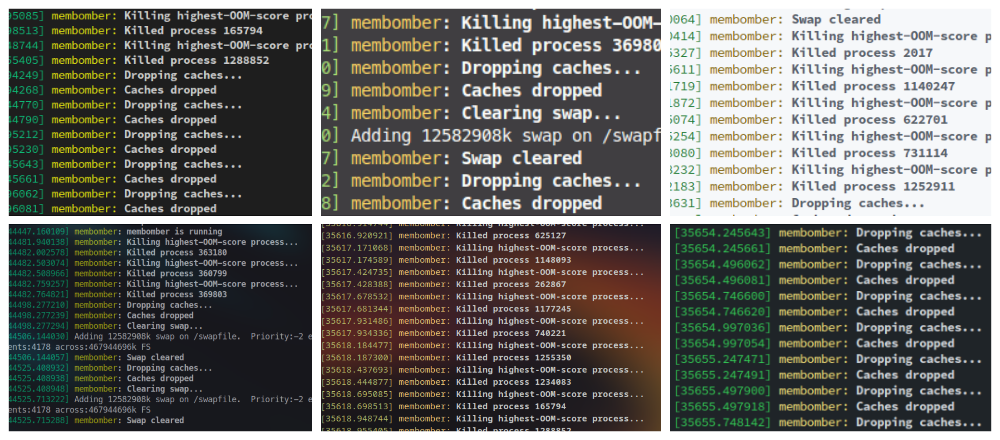

# `membomber`
`membomber` keeps your Linux desktop fast and responsive by proactively killing programs using too much memory and clearing swap/caches as needed.

## Usage
```sh
$ sudo membomber
```

## Installation
```sh
$ make
$ sudo make install
```
